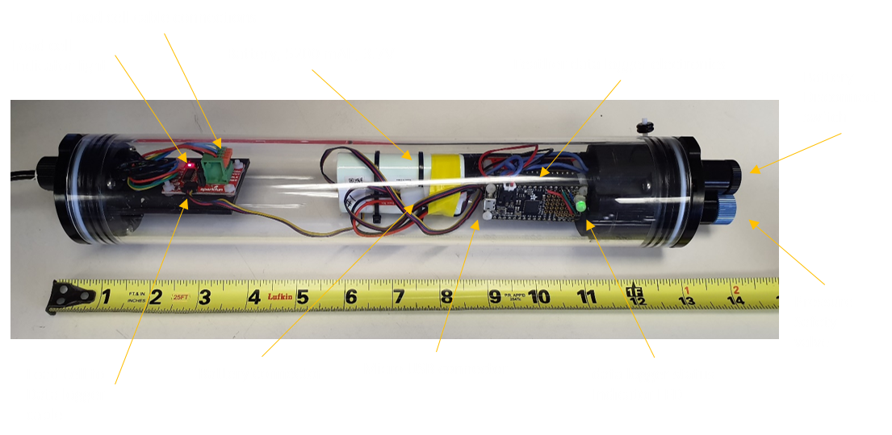

# endline_tension_meter
 Submersible load cell based endline tension meter

Original design by William DeVoe, Marine Resource Scientist at Maine Department of Marine Resources 

This version is built for the NOAA Northeast Fisheries Science Center and is a work in progress.  The main differences are:
- 3D printed framework to secure the electronics
- detachable wires from the end cap switch
- Qwiic shield to connect from the feather to the sensor board
- different load cell wiring
- larger battery and housing for 6 day endurance 
- add pressure relief valve
- refinements to the code

This repository is a scientific product and is not official communication of the National Oceanic and Atmospheric Administration, or the United States Department of Commerce. All NOAA GitHub project code is provided on an ‘as is’ basis and the user assumes responsibility for its use. Any claims against the Department of Commerce or Department of Commerce bureaus stemming from the use of this GitHub project will be governed by all applicable Federal law. Any reference to specific commercial products, processes, or services by service mark, trademark, manufacturer, or otherwise, does not constitute or imply their endorsement, recommendation or favoring by the Department of Commerce. The Department of Commerce seal and logo, or the seal and logo of a DOC bureau, shall not be used in any manner to imply endorsement of any commercial product or activity by DOC or the United States Government.
